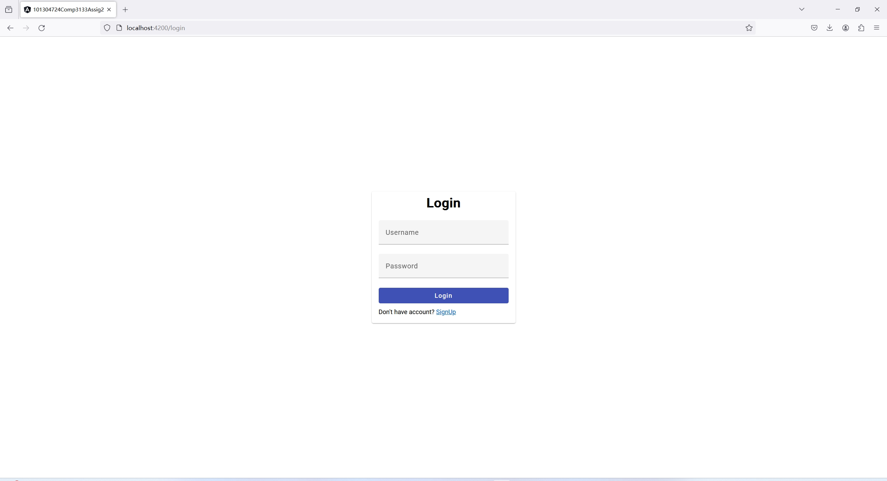
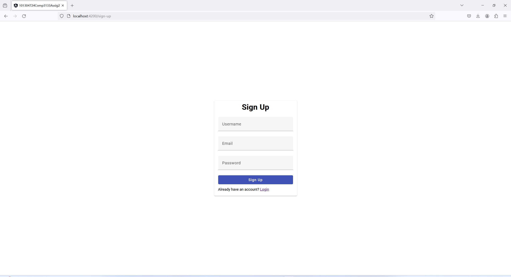
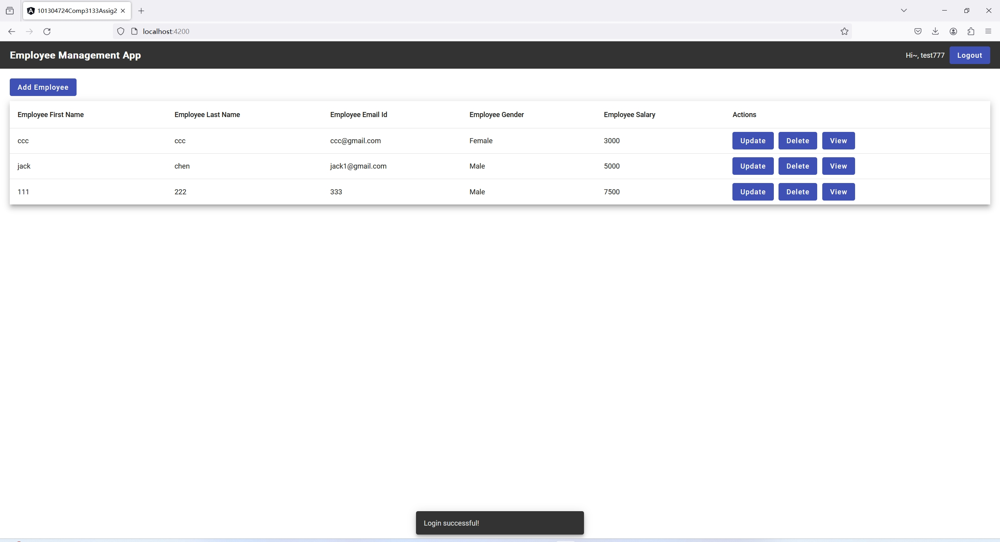
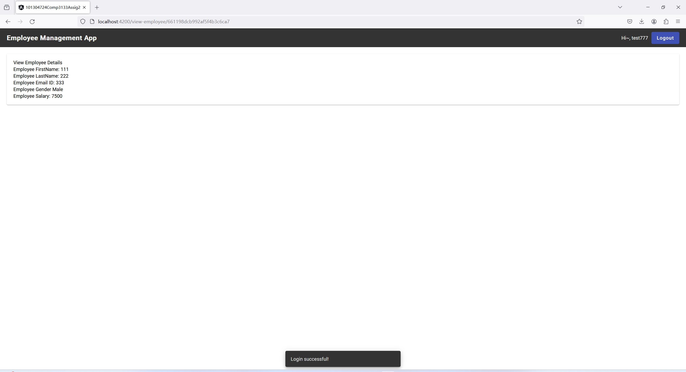
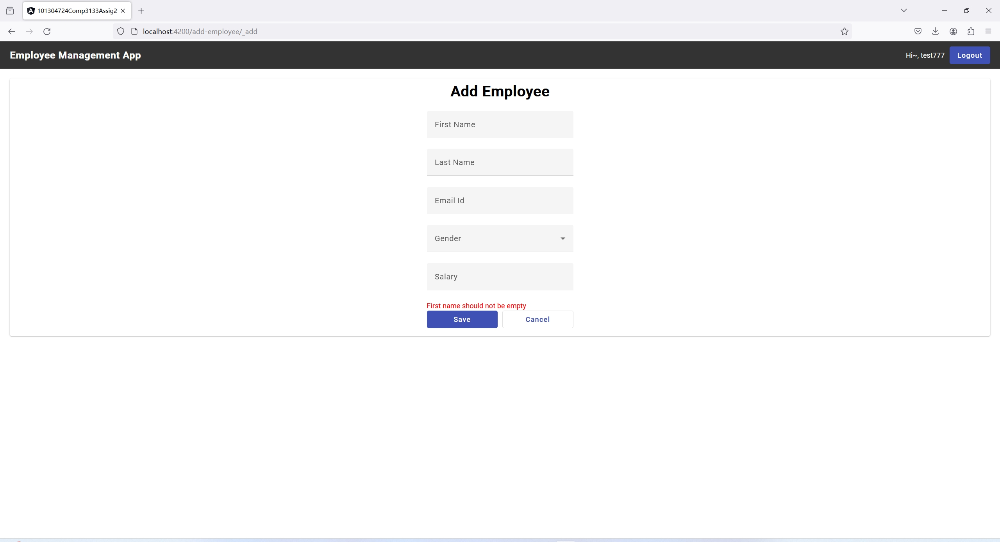
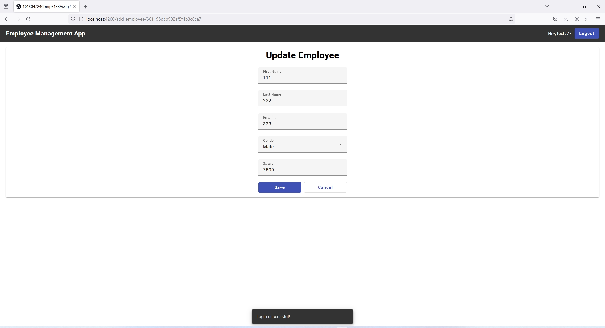

# 101304724Comp3133Assig2

This project was generated with [Angular CLI](https://github.com/angular/angular-cli) version 17.0.0.

### How to start
```
npm install
npm run start
```

### How to use
Navigate to `http://localhost:4200/`. The application will automatically reload if you change any of the source files.

### Examples
##### Login

##### Signup

##### Employee List

##### Employee Detail

##### Create new employees

##### Validation employees

##### Update employee

##### Delete employee by id
